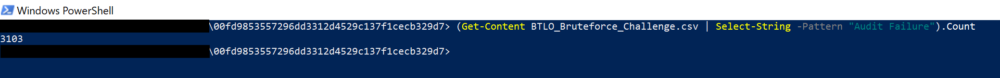

# BTLO-Bruteforce

<h3>Overview</h3>

<h4>Cloud Tools and Evnironment</h4>
PowerShell, Text editor, Excel, Google sheet

<h4>Source material</h4>

[Blue Team Lab Online](https://blueteamlabs.online/home)

<h2>Project walk-through</h2>

Firt go to Blue Team Lab Online aka BTLO to download the file.

 
Once you download the zip file. You will have to extract them and this will require a password which you can find next download file on BTLO website.

 
After extracting the zip file, you will find the following files:

- `BTLO_Bruteforce_Challenge.csv`
- `BTLO_Bruteforce_Challenge with Event log type`
- `BTLO_Bruteforce_Challenge with Text document type`
- `READ ME.md`
 
Please ensure you read the "READ ME" document as it may contain valuable information.
 
You can use any tool suitable for handling .csv files, such as PowerShell, a Text Editor, Excel, or Google Sheets. Please note that Google Sheets might alter the formatting when you upload the file.

 
We will be utilizing PowerShell for this task. 

Open up the PowerShell then type <b>cat .\BTLO_Bruteforce_Challenge.txt</b> to display the contents of the file. 
 
Please note that loading everything might take some time.

 
This is the screen you will see, and you'll notice that the scrollbar has gotten much smaller and moved all the way down.

Now that we have the logs displayed in PowerShell, let's dive into the questions.

 

 
<h4>Question #1: How many Audit Failure events are there?</h4>
We have the option to go through entire logs to find the answers we need, or we can efficiently use the command line in PowerShell.

Let's clear the screen with the <b>cls</b> command and start afresh.then type the following command:
 
<b>(Get-Content BTLO_Bruteforce_Challenge.csv | Select-String -Pattern "Audit Failure").Count</b> then we get our answer 3103.

 
<h4>Question #2: What is the username of the local account that is being targeted?</h4>
To find this, open a new PowerShell window and type:<b>cat .\BTLO_Bruteforce_Challenge.csv</b>

Then, scroll up to the last audit failure log. As you can see, the account name being targeted is "administrator."

 
<h4>Question #3: What is the failure reason related to the Audit Failure logs?</h4>
To answer this, refer back to the last log entry. Under the "Failure Information" section, you will find the failure reason listed as:

Failure Reason: Unknown user name or bad password.
 
This tells us that the audit failures are due to either unrecognized usernames or incorrect passwords.

 
<h4>Question #4: What is the Windows Event ID associated with these logon failures?</h4>
To find this, look at the last log entry. The Event ID associated with these logon failures is 4625.

 
I've also included this information in case you are not familiar with the term "Event ID."

Below is a sample log from the BTLO file:

<h2>Conclusion</h2>

